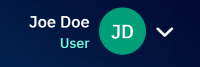
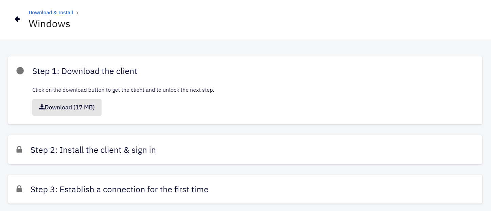
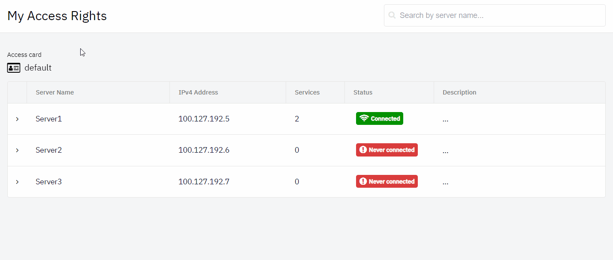

# Connect Me
This chapter describes the initial steps necessary for you to start using your Shieldoo Secure Network

## Download & Install
We will go through following steps:  
- [1. Login in Shieldoo webapp](/connect_me/#login-in-shieldoo-webapp)
- [2. Download & install Shieldoo client](/connect_me/#download-&-install-shieldoo-client)

### Login in Shieldoo webapp
At the moment when your Shieldoo Secure Network was successfully created together with your user and you were notified via email, this is the initial page requesting to login using your existing Microsoft or Google account.  

{: .note }
> User information
> 
> After successful login the name of the user, type of the user (e.g. 'User' or 'Admin') and the icon is shown in upper right corner.  
> 
> 
> 
> By clicking on the arrow icon it is possible to check the details of the account __My Account__ or to sign out from the site __Sign Out__.

### Download & install Shieldoo client
The following steps describe how to download and install Shieldoo desktop client:
1. Go to the **Connect Me** | **Download & Install** section.

    

2. Choose the download link according to the operating system you are using and click on the arrow button.

    

3. Download the client by clicking on the __Download__ button.

    

4. Install the client according to the well-guiding instructions.

    

5. While installing the client, the address parameter has to be entered tell the client where to connect.  

    

6. Last step consists of establishing the connection for the first time. 
    
    

7. When the setup is completed, you are securely connected! The following message is shown:

    

{: .note }
> Shieldoo icon
> 
> The icon in the system tray provides visual aid about the current status of the Shieldoo client.  
> 
> - Not Sign-in and Not Connected
> 
> - Sign-in and Not Connected
> 
> - Sign-in and Connected
> 

## Connect to Shieldoo Secure Network
This section describes the process of establishing a secure connection to a server and attached services in Shieldoo Secure Network.

- __Servers__ are devices that users or other servers can connect to.
- __Attached Services__ are a device that runs on the local network of a server, but on which Shieldoo Secure Network cannot be installed (e.g. a printer). Shieldoo allows you to connect to such services directly without having to connect to their servers first. These services are managed by the admin of Shieldoo Secure Network.

### Connect to Servers
After successful download and install the Shieldoo client, you can now securely connect to any server in Shieldoo Secure Network enabled to you by your administrator. 

To see the list of available servers, click on the client status icon in the system tray  and choose __My Access Rights In Shieldoo network__.

The other possibility is go to __Connect Me | My Access Rights__ in Shieldoo webapp.

It will show the list of available servers within your Shieldoo Secure Network with information about their names, IP addresses and description. In desctiptions, your administrator will tell you how to connect to the server.

### Connect to Attached Services
The method of connecting to an attached service depends on the type of the given service.
Here are the general steps:
1. Connect to your Shieldoo Secure Network by client.
Learn how to do that in the [Connect Me](/connect_me/) chapter.
2. Go to the **Connect Me** | **My Access Rights** section to see which servers are available to you.
3. Expand the row of a server that has any attached services configured.
4. Connect to an attached service by utilizing the IP address of the given server and the service port of the attached service.

{: .tip }For a specific instructions how to set such service, see the [Attached Services](/servers/#attached-services) section.

