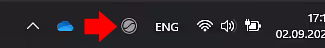
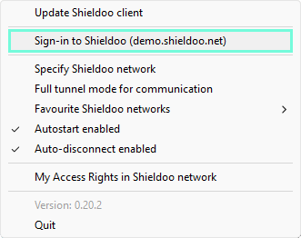
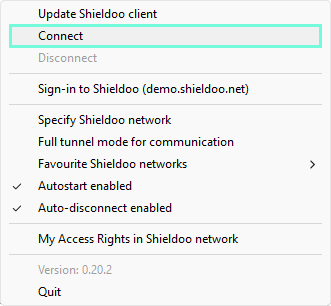

# Connect Me
This chapter describes the initial steps to start using your Shieldoo Secure Network.

## Download & Install
We will go through the following steps:  
1. [Login in Shieldoo web application](/connect_me/#login-in-shieldoo-web-application)
2. [Download & install the Shieldoo client](/connect_me/#download--install-the-shieldoo-client)

### Login in Shieldoo web application
When your Shieldoo Secure Network was successfully created together with your user, and you were notified via email, this is the initial page requesting to log in using your existing Microsoft or Google account.



{: .note }
> User information
> 
> After successful login, the name of the user, type of the user (e.g. 'User' or 'Admin') and the icon are shown in the upper right corner.  
>
> 
> 
> 
> By clicking on the arrow icon, it is possible to check the details of the account __My Account__ or to sign out from the site __Sign Out__.

### Download & install the Shieldoo client
The following steps describe how to download and install the Shieldoo desktop client:
1. Go to the __Connect Me__ \| __Download & Install__ section.



1. Choose the download link according to your operating system and click the arrow button.



1. Download the client by clicking the __Download__ button.

    

2. Install the client according to the well-guiding instructions.

    

3. While installing the client, the address parameter has to be entered to tell the client where to connect.

    

4. The last step consists of establishing the connection for the first time. 
    
    

5. When the setup is completed, you are securely connected! The following message is shown:

    

{: .note }
> Shieldoo icon
> 
> The icon in the system tray provides visual aid about the current status of the Shieldoo client.  
> 
> - Not Sign-in and Not Connect
> 
> - Sign-in and Not Connect
> 
> - Sign-in and Connect
> 

## Connect to Shieldoo Secure Network
This section describes establishing a secure connection to a server and attached services in Shieldoo Secure Network.

- __Servers__ are devices to which users or other servers can connect.
- __Attached Services__ are a device that runs on the local network of a server but on which Shieldoo Secure Network cannot be installed (e.g. a printer). Shieldoo lets you directly connect to such services without connecting to their servers. These services are managed by the admin of Shieldoo Secure Network.

### Connect to Servers
After successfully downloading and installing the Shieldoo client, you can now securely connect to any server in Shieldoo Secure Network enabled by your administrator.

To see the list of available servers, click on the client status icon in the system tray  and choose __My Access Rights In Shieldoo network__.

The other possibility is to go to __Connect Me__ \| __My Access Rights__ in Shieldoo web application.

It will show the list of available servers within your Shieldoo Secure Network with information about their names, IP addresses and description. In descriptions, your administrator will tell you how to connect to the server.

### Connect to the Attached Services
The method of connecting to an attached service depends on the type of the given service.
Here are the general steps:
1. Connect to your Shieldoo Secure Network by the client.
2. Go to the __Connect Me__ \| __My Access Rights__ section to see which servers are available to you.
3. Expand the row of a server with any attached services configured.
4. Connect to an attached service by utilizing the given server's IP address and the attached service's port.

{: .tip }
> For specific instructions on how to set such a service, see the [Attached Services](/servers/#attached-services) section.
