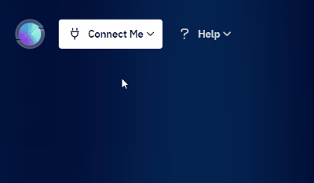
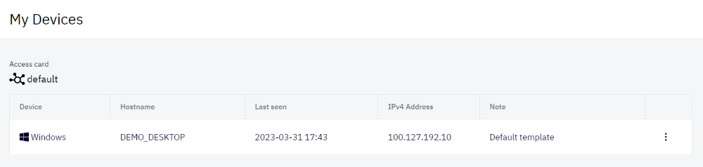
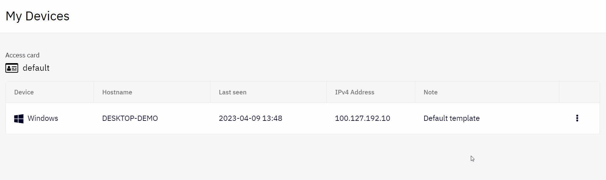

# My Devices

My devices are devices on which users installed the Shieldoo client, and they can connect from it to the Shieldoo Secure Network.

## View My Devices
The following steps describe how to view my devices in your Shieldoo Secure Network:
1. Log in to your organization's Shieldoo Secure Network web application.
2. Go to the **Connect Me** | **My Devices** section.

   

3. It will provide the following view showing all your devices from which you connect to the Shieldoo Secure Network.

   

4. Learn how to download & install the Shieldoo client and connect to the Shieldoo Secure Network, see the [Connect Me](/connect_me/) chapter.

{: .note }
>The devices are automatically added to the list of my devices after the Shieldoo client is installed and the first connection to the Shieldoo Secure Network.

## Editing My Devices

The following steps describe how to edit your devices in your Shieldoo Secure Network:
1. Open the context menu of the devices you want to edit:

   

2. Use the provided options to edit the device:  
   - **Edit Note** - Opens the device note, which you can edit.
   - **Delete** - Deletes the device from your Shieldoo Secure Network. 

{: .note }
If you delete the device, the Shieldoo client will not be uninstalled from the device, and the device will be able to reconnect to the network and be re-added to the My Devices table.

