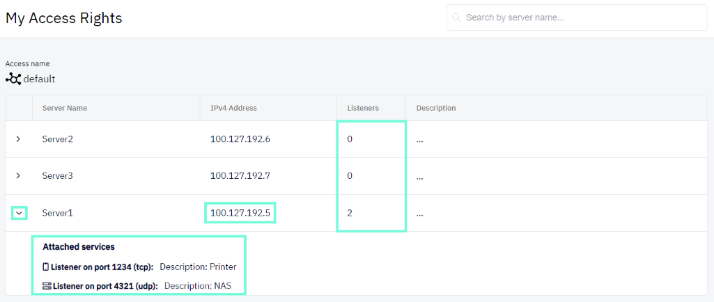
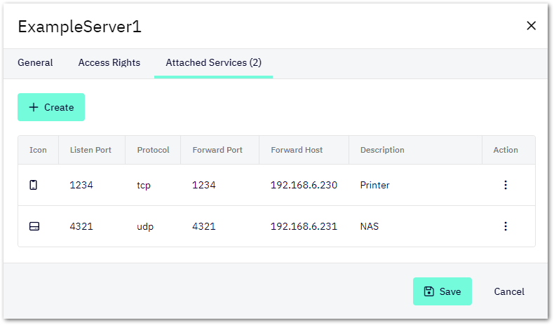

# Connect to a Attached Services
## Attached Services
An attached service is a device that runs on the local network of a server (configured in Shieldoo Secure Network), but on which Shieldoo cannot be installed (e.g. a printer). 

Shieldoo allows you to connect to such services directly without having to connect to their servers first. These services are managed by the administrator of Shieldoo Secure Network.

{: .tip }
> For a specific instructions how to set such service, see the [Attached Services](https://docs.shieldoo.io/attached_services/) chapter.

## Connecting to Attached Services
The method of connecting to an attached service depends on the type of the given service.
Here are the general steps:
1. Connect to your Shieldoo network as a client.
Learn how to do that in the [Connect Me](https://docs.shieldoo.io/connect_me/) chapter.
2. Go to the __Devices | My Access Rights__ section to see which servers are available to you.
3. Expand the row of a server that has any attached services configured to see the services’ listen ports.
4. Connect to an attached service by utilizing the IP address of the given server and the listen port of the attached service.
