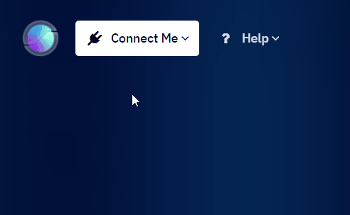
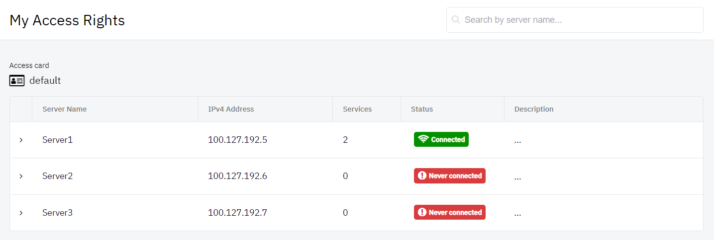
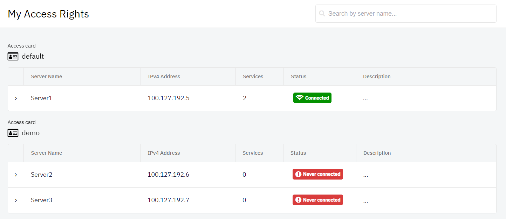
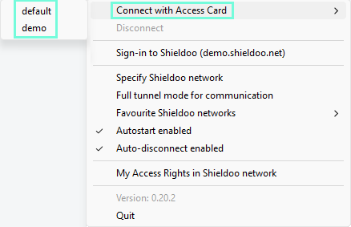

# My Acces Rights
This chapter describes how the access rights are set and how the access cards work in the Shieldoo Secure Network. 

## Access Rights
The access rights to different servers are managed by your Shieldoo Secure Network administrator. They can not be set by the user themself. If they are placed, Shieldoo forces the user to connect to the network under its restriction.

The following steps describe how to view my access rights in your Shieldoo Secure Network:
1. Log in to your organization's Shieldoo Secure Network web application.
2. Go to the **Connect Me** | **My Access Rights** section.

    

3. It will provide the following view showing all your access rights:

    

## Access cards
The access cards enable the administrator to set different access rights to other sites and to assign multiple access cards to users. So one user can have multiple access cards and select which access card to use when connecting to the network.

The access cards become available to you as a connection profile in the system tray icon menu of the Shieldoo client.

{: .tip }
> For a specific example of connecting to a server, see the [Connect Me](/connect_me/) chapter.