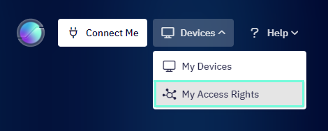
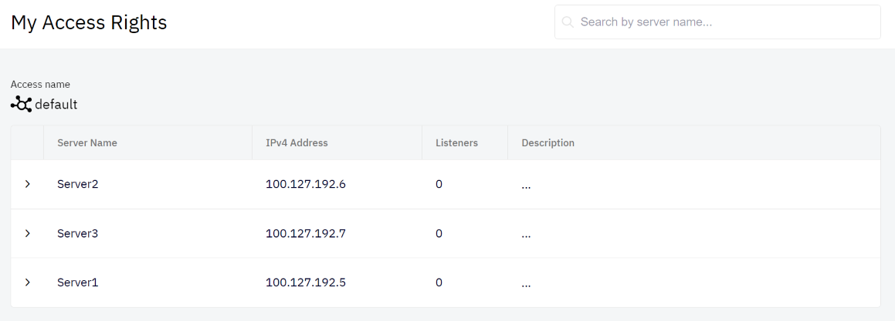
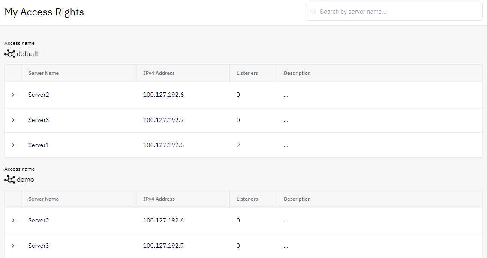

# Access Rights and Access Cards
This chapter describes how the access rights are set and how the access cards works in the Shieldoo Secure Network. 

## Access rights
The access rights to different servers are managed by your Shieldoo Secure Network administrator, they can not be set by the user himself/herself. If they are set, Shieldoo forces the user to connect to the network under its restriction. 
You can see the access rights by clicking on __Devices__ button on the top left corner of the Shieldoo window and then click on __My Access Rights__ button.

It will provide the following view showing all the sites you are able to access:

## Access cards 
The access cards enables the administrator to set different access rights to different sites and to assign multiple access cards to users. So one user can have mutliple access cards available and can select which access card to use when connecting to the network. 

The access cards become available to you as connection profile in the menu of Shieldoo’s system tray icon.

{: .tip }
> For a specific example of connecting to a server, see the [Connect to a server](https://docs.shieldoo.io/connect_to_server/) chapter.