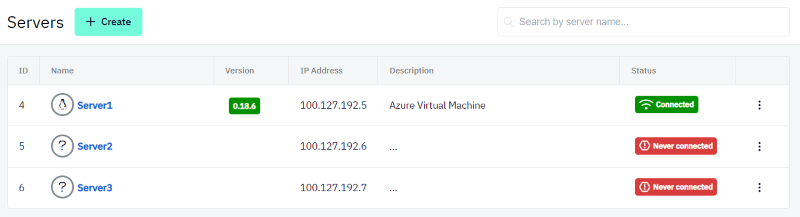

# Servers
Servers in a Shieldoo Secure Network are devices that users or other servers can connect to.

## Installing Servers
The following steps describe how to install a server in your Shieldoo Secure Network:
1. Go to the machine on which you want to install the server.
2. Log in to your organization's Shieldoo Secure Network web application.
3. Create a placeholder for the server in your network:
   1. Go to the **Devices** \| **Servers** section.
   2. Click on the **Create** button to open the Create Server dialog.
   3. Configure the basic server settings:  
       - **Name** - Give the server a descriptive name.
       - **Note** - Describe the server's purpose.
   4. Click on the **Create** button again to open the installation instructions.
4. Follow the installation instructions to install the server-side Shieldoo Secure Network application on the given machine.
5. Learn how to connect to the prepared server in the [Connecting to a Server](/server_connection/) section.

{: .warning }
> - The configuration data (provided to you by the installation instructions) contains the secret key to your server.  
Do not share it with anyone to prevent unauthorized users from exploiting it.
> - By default, each server allows any inbound and outbound traffic.  
To restrict access to the services running on the given server, you can configure a firewall. Learn how to do that in the [Access Management](/access_management/) chapter.

## Editing Servers
This section describes how to edit a server's configuration after it has been created:
1. Open the context menu of the server whose configuration you want to edit:  

2. Use the provided options to edit the server:  
   - **Detail** - Opens the installation instructions that you used to install the server.
   - **Edit** - Opens the server's configuration which you can edit.
   - **Delete** - Deletes the server from your Shieldoo Secure Network.  
   No users or other servers will be able to connect to it.

<!---## Attached Service-->