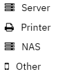

# Servers
Servers in a Shieldoo Secure Network are devices to which users or other servers can connect.



## Installing Servers
{: .d-inline-block }
[__ADMIN__](/admin_getting_started/#administration-modes){: style="color: white; text-decoration: none;"}
{: .label .label-purple }

The following steps describe how to install a server in your Shieldoo Secure Network:
1. Go to the machine you want to install the server.
2. Log in to your organization's Shieldoo Secure Network web application.
3. Create a placeholder for the server in your network:
   1. Go to the __Network__ \| __Servers__ section.
   2. Click on the __Create__ button to open the Create Server dialog.
   3. Configure the basic server settings:  
       - __Name__ - Give the server a descriptive name.
       - __Note__ - Describe the server's purpose.
       - __Automatic update__ - Enables automatic server-side application updates to the latest version.
   4. Click the __Create__ button again to open the installation instructions.
4. Follow the installation instructions to install the server-side Shieldoo Secure Network application on the machine.
5. Learn how to connect to the prepared server in the [Connect Me](/connect_me/) chapter.

{: .warning }
> - The configuration data (provided by the installation instructions) contains the secret key to your server.  
Do not share it with anyone to prevent unauthorized users from exploiting it.
> - By default, each server allows any inbound and outbound traffic.  
You can configure a firewall to restrict access to the services running on the given server. Learn how to do that in the [Access Management](/access_management/) chapter.

{: .note }
> The icons in the list of servers provide visual information about the current server status:
>- 
_The server was never connected to the network, and other enabled nodes (users and servers) can not connect to this server. The server may not have been installed yet._
>- 
_The server is connected to the network in Peer-to-Peer mode or Relay mode, and other enabled nodes (users and servers) can connect to this server._
>- 
_The server is connected to the network in Websocket mode, and other enabled nodes (users and servers) can connect to this server._
>- 
_The server is not connected to the network, and other enabled nodes (users and servers) can not connect to this server. The server will need to be turned on, woken up or restarted._
>- 
_The server is not connected to the network, and other enabled nodes (users and servers) can not connect to this server because of a network connection problem._

## Editing Servers
{: .d-inline-block }
[__ADMIN__](/admin_getting_started/#administration-modes){: style="color: white; text-decoration: none;"}
{: .label .label-purple }

This section describes how to edit a server's configuration after it has been created:
1. Open the context menu of the server whose configuration you want to edit:

   

2. Use the provided options to edit the server:  
   - __Detail__ - Open the installation instructions you used to install the server.
   - __Edit__ - Open the server's configuration, which you can edit.
   - __Delete__ - Deletes the server from your Shieldoo Secure Network.  
   No users or other servers will be able to connect to it.

## Attached Services
{: .d-inline-block }
[__ADMIN \| EXPERT__](/admin_getting_started/#administration-modes){: style="color: white; text-decoration: none;"}
{: .label .label-green }

An attached service is a device that runs on the local network of a server (configured in Shieldoo) but on which Shieldoo cannot be installed (e.g. a printer). Shieldoo lets you directly connect to such services without connecting to their servers.



### Configuring Attached Services
The following steps describe how to configure a connection to an attached service:
1. Log in to your organization's Shieldoo Secure Network web application.
2. Enable __Expert Mode__.
   - See the [Access Management](/access_management/) chapter to learn how to enable Expert Mode.
3. Go to the __Network__ \| __Servers__ section.
4. Open the server's context menu whose local network runs the service you want to connect to.

   

5. Click on __Edit__ to open the server's settings.
6. Go to the __Attached Services__ tab.
7. Click on the __Create__ button to open the _Create Attached Service_ dialog.
8. Configure the attached service settings:
   - __Type__ - Select what type of attached service you are configuring: _Server_, _Printer_, _NAS_, or _Other_.  
   The __Attached Services__ tab will display the corresponding icon to indicate the type of each configured service.  
   
   - __Listen port__ - Define the port you want the service to run within the Shieldoo network.
   - __Protocol__ - Select the network protocol: _TCP_ or _UDP_. <!---Co přesně je to za protokol?-->
   - __Forward port__ - Define the port on which the service you want to connect runs on the server's local network.   
   Shieldoo will map this port to the port defined by the __Listen port__ setting.
   - __Forward host__ - Define the IP address or hostname of the service you want to connect to.
   - __Description__ - Describe the attached service's purpose.
9. Click on the __Save__ button to create the connection to the configured attached service.
10. Learn how to connect to the prepared attached service in the [Connect Me](/connect_me/) chapter.

For a specific example of connecting to an attached service, see the [Sharing a Printer](/examples/#sharing-a-printer) section.

{: .note }
> Who can use attached services is governed by the same firewall rules as those that can be configured for servers.  
> 
> For more information, see the [Access Management](/access_management/) chapter.