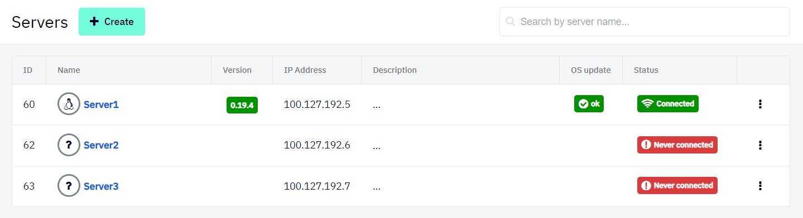

# Servers
Servers in a Shieldoo Secure Network are devices to which users or other servers can connect.

## Installing Servers
The following steps describe how to install a server in your Shieldoo Secure Network:
1. Go to the machine you want to install the server.
2. Log in to your organization's Shieldoo Secure Network web application.
3. Create a placeholder for the server in your network:
   1. Go to the **Network** | **Servers** section.
   2. Click on the **Create** button to open the Create Server dialog.
   3. Configure the basic server settings:  
       - **Name** - Give the server a descriptive name.
       - **Note** - Describe the server's purpose.
       - **Automatic update** - Enables automatic server-side application updates to the latest version.
   4. Click the **Create** button again to open the installation instructions.
4. Follow the installation instructions to install the server-side Shieldoo Secure Network application on the machine.
5. Learn how to connect to the prepared server in the [Connect Me](/connect_me/) chapter.

{: .warning }
> - The configuration data (provided by the installation instructions) contains the secret key to your server.  
Do not share it with anyone to prevent unauthorized users from exploiting it.
> - By default, each server allows any inbound and outbound traffic.  
You can configure a firewall to restrict access to the services running on the given server. Learn how to do that in the [Access Management](/access_management/) chapter.

## Editing Servers
This section describes how to edit a server's configuration after it has been created:
1. Open the context menu of the server whose configuration you want to edit:

   

2. Use the provided options to edit the server:  
   - **Detail** - Open the installation instructions you used to install the server.
   - **Edit** - Open the server's configuration, which you can edit.
   - **Delete** - Deletes the server from your Shieldoo Secure Network.  
   No users or other servers will be able to connect to it.

## Attached Services
An attached service is a device that runs on the local network of a server (configured in Shieldoo) but on which Shieldoo cannot be installed (e.g. a printer).

Shieldoo lets you directly connect to such services without connecting to their servers.

### Configuring Attached Services
The following steps describe how to configure a connection to an attached service:
1. Log in to your organization's Shieldoo Secure Network web application.
2. Enable **Expert Mode**.
   - See the [Access Management](/access_management/) chapter to learn how to enable Expert Mode.
3. Go to the **Network** | **Servers** section.
4. Open the server's context menu whose local network runs the service you want to connect to.

   

5. Click on **Edit** to open the server's settings.
6. Go to the **Attached Services** tab.
7. Click on the **Create** button to open the _Create Attached Service_ dialog.
8. Configure the attached service settings:
   - **Type** - Select what type of attached service you are configuring: _Server_, _Printer_, _NAS_, or _Other_.  
   The **Attached Services** tab will display the corresponding icon to indicate the type of each configured service.  
   
   - **Listen port** - Define the port you want the service to run within the Shieldoo network.
   - **Protocol** - Select the network protocol: _TCP_ or _UDP_. <!---Co přesně je to za protokol?-->
   - **Forward port** - Define the port on which the service you want to connect runs on the server's local network.   
   Shieldoo will map this port to the port defined by the **Listen port** setting.
   - **Forward host** - Define the IP address or hostname of the service you want to connect to.
   - **Description** - Describe the attached service's purpose.
9. Click on the **Save** button to create the connection to the configured attached service.

{: .note }
> Who can use attached services is governed by the same firewall rules as those that can be configured for servers.  
> 
> For more information, see the [Access Management](/access_management/) chapter.

### Connecting to the Attached Services
The method of connecting to an attached service depends on the type of the given service.

Here are the general steps:
1. Connect to your Shieldoo network as a client.  
   - Learn how to do that in the [Connect Me](/connect_me/) chapter.
2. Go to the **Connect Me** | **My Access Rights** section to see which servers:
   - Are available to you.
   - Have attached services configured (see the **Services** column).
3. Expand the row of a server with any attached services configured and see the listening ports for those services.
4. Connect to an attached service by utilizing the:
   - The IP address of the given server.
   - The service/listen port of the attached service.

{: .tip }
> For a specific example of connecting to an attached service, see the [Sharing a Printer](/examples/#sharing-a-printer) section.