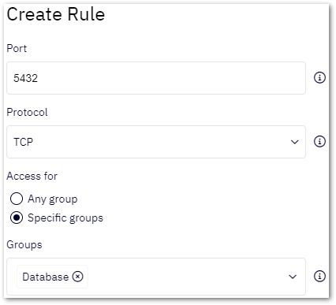
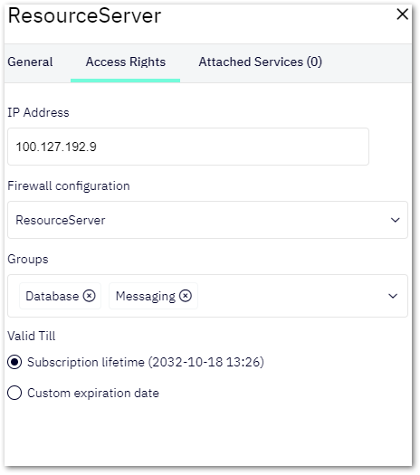

# Access Management
By default, when you set up your Shieldoo Secure Network, all network nodes (users and server) can access each other.  

The default setup might be sufficient for your solution. If not, advanced users can utilize the **Expert Mode** to secure the traffic passing between the network and its nodes (users and servers):  
1. Enable the **Expert Mode** to gain access to all the access management features.

2. Learn about what you can accomplish using the access management features in the [Access Management Example](/access_management/#access-management-example) section.
3. Configure the access management features to suit your security needs: 
   - [Groups](/access_management/#groups)
   - [Firewalls](/access_management/#firewalls)
   - [Access Cards](/access_management/#access-cards)

## Access Management Example
The following schema shows an example scenario which you can configure using Shieldoo's access management features:  

**Developer** - Demostrates a user that needs access to both services running on the resource server.  
The developer has an access card that does the following:
  1. Maps the user to the _Database_ and _Messaging_ groups.
  2. Assigns a custom firewall to the user, blocking any inbound traffic and allowing any outbound traffic.  

**Application Server** - Demonstrates a server that runs a web application which needs access to the database running on the resource server.  
The application server has an access card that does the following:
  1. Maps the server to the _Database_ group.
  2. Assigns a custom firewall to the server, blocking any inbound traffic and allowing any outbound traffic.  

**Resource Server** - Demonstrates a server that runs two services which other servers or users need to access.  
The resource server has an access card that does the following:
  1. Maps the server to the _Database_ and _Messaging_ groups.
  2. Assigns a custom firewall to the server, allowing any outbound traffic and blocking all the inbound traffic except for the following ports:
     - 5432 - Only users or servers in the _Database_ group can access it.
     - 61616 - Only users or servers in the _Messaging_ group can access it.

## Groups
A group in a Shieldoo Secure Network is a mechanism that maps specific firewall rules to specific users or servers.  

A group alone does not do any mapping. It only indicates what type of access the group will manage. [Firewalls](/access_management/#firewalls) and [access cards](/access_management/#access-cards) will use created groups to do the mapping.

### Creating Groups
The following steps describe how to create groups:
1. Log in to your organization's Shieldoo Secure Network web application.
2. Enable **Expert Mode**.
3. Go to the **Network** | **Groups** section.
4. Click on the **Create** button to open the **Create Group** dialog.
5. Configure the group settings:
    - **Name** - Give the group a descriptive name.
    - **Description** - Describe the group's purpose.
6. Click on the **Create** button to confirm the group's creation.
7. Continue by [creating firewalls](/access_management/#firewalls), utilizing the created groups.

## Firewalls
A firewall in a Shieldoo Secure Network configures rules that determine which traffic can pass between the network and its nodes (users and servers).  

### Creating Firewalls
The following steps describe how to create firewalls:
1. Log in to your organization's Shieldoo Secure Network web application.
2. Enable **Expert Mode**.
3. Go to the **Network** | **Firewall** section.
4. Click on the **Create** button to open the **Create Firewall** dialog.
5. Configure the firewall settings:  

    - **Name** - Give the firewall a descriptive name.
    - **Inbound Rules** - Filter traffic passing from the network to a node (user or server).  
    - **Outbound Rules** - Filter traffic passing from a node (user or server) to the network. 
1. Learn how to configure the firewall rules in the [Configuring Firewall Rules](/access_management/#configuring-firewall-rules) section.
2. Click on the **Create** button to confirm the firewall's creation.
3. Continue by [creating access cards](/access_management/#access-cards) to map the created firewall rules to specific nodes (users or servers).

{: .warning }
> By default, a user can be accessed by another user or by a server.
> 
> We highly recommend that you secure the users in your network with a specific firewall. Learn how to do that in the [Securing Users](/users/#securing-users) section.

### Configuring Firewall Rules
This section describes the settings of the **Create Rule** dialog:  

- **Port** - Define the port of the service for which you want to configure the given firewall rule.
- **Protocol** - Define a specific protocol to be allowed:
  - [TCP](https://en.wikipedia.org/wiki/Transmission_Control_Protocol)
  - [UDP](https://en.wikipedia.org/wiki/User_Datagram_Protocol)
  - [ICMP](https://en.wikipedia.org/wiki/Internet_Control_Message_Protocol)
  - Any - Configures the rule to be evaluated regardless of the protocol used.
- **Access for** - Select which group you want to map to the given rule:
  - _Any group_ - Defines that any user or server can access the given port.
  - _Specific groups_ - Use the provided **Groups** combo box to select the groups whose users or servers can access the given port.

{: .example }
> If you map a rule to a group called _Database_, only users or servers mapped (in their [access cards](/access_management/#access-cards)) to that group will be able to access the given port.

## Access Cards
An access card in a Shieldoo Secure Network maps firewall rules and groups to specific servers or users. In other words, it determines which services users or servers can access within the network.

### Creating Server Access Cards
The following steps describe how to create access cards for servers:
1. Log in to your organization's Shieldoo Secure Network web application.
2. Enable **Expert Mode**.
3. Go to the **Network** | **Servers** section.
4. Open the context menu of the server for which you want to create an access card.
5. Click on **Edit** to open the server's settings.
6. Go to the **Access Rights** tab where the access card is configured.
7. Configure the access card settings:  
   - **IP Address** - Skip this setting unless the IP address of the given server has changed since you created it.
   - **Firewall configuration** - Select one of the prepared firewalls.
   - **Groups** - Map the server with all the desired groups.
   - **Punch back** - Enable this check box if you want the node that you are trying to reach to connect back to your if your [UDP hole punching](https://en.wikipedia.org/wiki/UDP_hole_punching) fails. This is useful if a node is behind, for example, a symmetric NAT.
   - **Use websocket gateway** - Check this check box if you want to use the Shieldoo websocket gateway to enforce the connection even from a site where, for example, UDP is not allowed.
   - **Valid Till** - Define how long the access card will remain valid:
     - _Subscription lifetime_ - Defines that the access card will remain valid as long as your organization is subscribed to Shieldoo.
     - _Custom expiration date_ - Defines a custom expiration using the provided date picker.
8. Click on the **Save** button to confirm the access card's creation.

 

### Creating User Access Cards
The following steps describe how to create access cards for users:
1. Log in to your organization's Shieldoo Secure Network web application.
2. Enable **Expert Mode**.
3. Go to the **Network** | **Users** section.
4. Open the context menu of the user for whom you want to create an access card.
5. Click on **Detail** to open the **Access control** tab.
6. Click on the **Create Access** button.
7. Select one of the following options:  
    - _From scratch_ - Configure the access card manually.  
    The user access card settings are a simplified form of the [server access card settings](/access_management/#creating-server-access-cards).
    - _From template_ - Select a prepared user access card template.  
    You can prepare user access card templates in the **Network** | **Access Card Templates** section.

### Connecting to Shieldoo Using an Access Card
When an administrator configures an access card for a user, Shieldoo forces the user to connect to the network under its restrictions.

If multiple access cards are available to a user, they can select which access card they want to use when connecting to the network.

The access cards become available to users as connection profiles in the context menu of Shieldoo's system tray icon.

