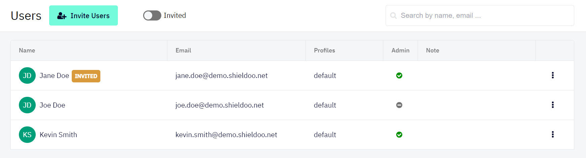

# Users
Users in a Shieldoo Secure Network are clients that can connect to servers.

## Inviting Users to the Network
The following steps describe how to invite users to your Shieldoo network:
1. Log in to your organization's Shieldoo Secure Network web application.
2. Go to the **Users** section.
3. Click on the **Invite Users** button to open the Invite Users dialog.
4. Configure the user invitation settings:  
    - **Email** - Enter the email address of the user you want to invite.
    - **Admin** - Define whether or not to give the given user the network administrator rights.
    - **Note** - Describe the user. For example, their role in your organization.
5. Repeat steps 3-4 until you have configured all the users you want to invite.
6. Check that the given users have been added to the list of users in your network.
7. Monitor the **INVITED** label to find out whether or not the given users have accepted the invitation:  
    - Label displayed - Invitation not accepted yet.
    - Label not displayed - Invitation accepted.
8. Let the users know they can [connect to your organization's network](/network_connection/) as soon as they accept the invitation.
9. Continue by [securing your users](/users/#securing-users).

{: .tip }
> - Use the **Invited** button to only display users who have not accepted their invitation yet.  
> 
> - Use the provided search field to search for specific users by their name or email address.  
> 

## Securing Users
By default, a user can be accessed by another user or by a server.

We highly recommend that you secure the users in your network in the following way:
1. Enable __Expert Mode__.
2. [Configure a firewall](/access_management/#firewalls) with the following properties:  
    - __Inbound Rules__ - Configure no inbound rules to prevent anyone from accessing users.
    - __Outbound Rules__ - Configure an outbound rule that grants users access to `Any` ports opened by servers in the network.
3. Create a user access card template with the configured firewall:
   1. Go to the __System Configuration__ \| __User Access Templates__ section.
   2. Click on the __Create__ button.
   3. Configure the template settings.  
   Those settings are a simplified form of the [server access card settings](/access_management/#creating-server-access-cards).
   1. Click on the __Create__ button to confirm the template's creation.
4. [Create an access card](/access_management/#access-cards) for each user in your network using the prepared template.

## Editing Users
This section describes how to edit a user's configuration after they have been invited:
1. Open the context menu of the user whose configuration you want to edit:  

2. Use the provided options to edit the server:  
   - **Edit** - Opens the user's configuration which you can edit.
   - **Grand admin rights** - Grants the given user the network administrator rights.
   - **Revoke admin rights** - Removes the network administrator rights from the given user.
   - **Delete** - Deletes the user from your Shieldoo Secure Network.  
   The user will no longer be able to connect to the network.