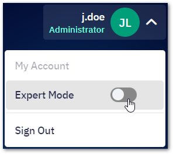

# Getting Started
This chapter introduces the concepts important for the administrators of your Shieldoo Mesh network.

## Administration Modes
Shieldoo Mesh provides administrators with the following configuration modes:
- __Simple Mode__ - Configures the network quickly, allowing any network traffic.  
- __Expert Mode__ - Secures the network by establishing rules for filtering incoming and outgoing traffic.  
To enable the expert mode, use the __Expert Mode__ button in the user menu:  

## Servers
Servers in a Shieldoo Mesh network are devices that users or other servers can connect to.

To learn how to install servers in your Shieldoo Mesh network, see the [Servers](/servers/) chapter.

## Users
Users in a Shieldoo Mesh network are clients that can connect to servers. Other clients or servers cannot connect to a user.

To learn how to invite users to your Shieldoo Mesh network, see the [Users](/users/) chapter.

## Groups
A group in a Shieldoo Mesh network is a mechanism that maps specific firewall rules to specific users or servers.

To learn how to create groups, see the [Group](/access_management/#groups) section in the Access Management chapter.

## Firewalls
A firewall in a Shieldoo Mesh network configures rules that determine which groups can access which services running on the network. 

To learn how to create firewalls, see the [Firewall](/access_management/#firewalls) section in the Access Management chapter.

## Access Cards
An access card in a Shieldoo Mesh network maps firewall rules and groups to specific servers or users. In other words, it determines which services users or servers can access within the network.

To learn how to create access cards, see the [Access Card](/access_management/#access-cards) section in the Access Management chapter.

<!---Listener-->