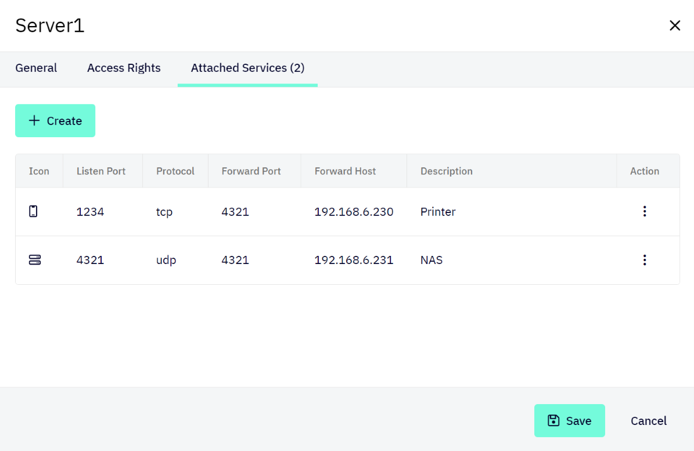
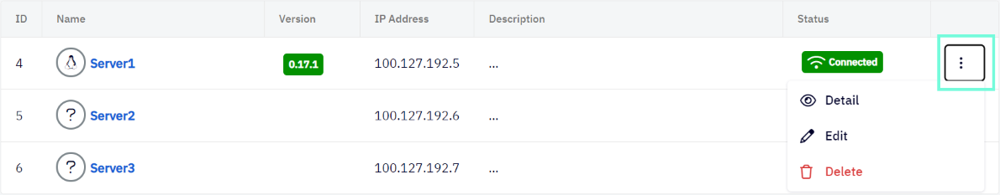
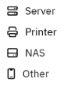

# Attached Services
An attached service is a device that runs on the local network of a server (configured in Shieldoo), but on which Shieldoo cannot be installed (e.g. a printer).

Shieldoo allows you to connect to such services directly without having to connect to their servers first.

## Configuring Attached Services
The following steps describe how to configure a connection an attached service:
1. Log in to your organization's Shieldoo Mesh web application.
2. Enable __Expert Mode__.
3. Go to the **Devices** \| **Servers** section.
4. Open the context menu of the server whose local network is running the service you want to connect to.

5. Click on __Edit__ to open the server's settings.
6. Go to the __Attached Services__ tab.
7. Click on the **Create** button to open the _Create Attached Service_ dialog.
8. Configure the attached service settings:
   - __Type__ - Select what type of attached service you are configuring: _Server_, _Printer_, _NAS_, or _Other_.  
   The __Attached Services__ tab will display the corresponding icon to indicate the type of each configured service.  
   
   - __Listen port__ - Define the port on which you want the service to run within the Shieldoo network.
   - __Protocol__ - Select the network protocol: _TCP_ or _UDP_. <!---Co přesně je to za protokol?-->
   - __Forward port__ - Define the actual port on which the service that you want to connect to runs on the local network of the given server.  
   Shieldoo will map this port to the port defined by the __Listen port__ setting.
   - __Forward host__ - Define the IP address or hostname of the service that you want to connect to.
   - __Description__ - Describe the attached service's purpose.
9. Click on the __Save__ button to create the connection to the configured attached service.

{: .note }
> Who can use attached services is governed by the same firewall rules as those that can be configured for servers.  
> 
> For more information, see the [Access Management](/access_management/) chapter.

## Connecting to Attached Services
The method of connecting to an attached service depends on the type of the given service.

Here are the general steps:
1. Connect to your Shieldoo network as a client.  
Learn how to do that in the [Connect Me](/connect_me/) chapter.
2. Go to the **Devices** \| **My Access Rights** section to see which servers:
   - Are available to you.
   - Have attached services configured (see the __Listeners__ column).
3. Expand the row of a server that has any attached services configured to see the services' listen ports.
4. Connect to an attached service by utilizing:
   - The IP address of the given server.
   - The listen port of the attached service.

{: .tip }
> For a specific example of connecting to an attached service, see the [Sharing a Printer](/examples/#sharing-a-printer) section.