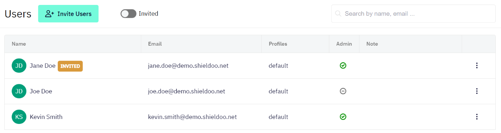
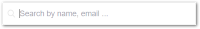
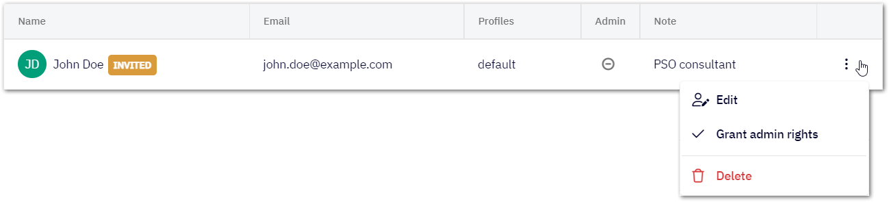

# Users
Users in a Shieldoo Mesh network are clients that can connect to servers. Other clients or servers cannot connect to a user.

## Inviting Users to the Network
This section describes how to invite users to your Shieldoo Mesh network:
1. Log in to your organization's Shieldoo Mesh web application.
2. Go to the **Users** section.
3. Click on the **Invite Users** button to open the Invite Users dialog.
4. Configure the user invitation settings:  
    - **Email** - Enter the email address of the user you want to invite.
    - **Admin** - Define whether or not to give the given user the network administrator rights.
    - **Note** - Describe the user. For example, their role in your organization.
5. Repeat steps 3-4 until you have configured all the users you want to invite.
6. Check that the given users have been added to the list of users in your network.
7. Monitor the **INVITED** label to find out whether or not the given users have accepted the invitation:  
    - Label displayed - Invitation not accepted yet.
    - Label not displayed - Invitation accepted.
8. Let the users know they can [connect to your organization's network](/network_connection/) as soon as they accept the invitation.

{: .tip }
> - Use the **Invited** button to only display users who have not accepted their invitation yet.  
> 
> - Use the provided search field to search for specific users by their name or email address.  
> 

## Editing Users
This section describes how to edit a user's configuration after they have been invited:
1. Open the context menu of the user whose configuration you want to edit:  

2. Use the provided options to edit the server:  
   - **Edit** - Opens the user's configuration which you can edit.
   - **Grand admin rights** - Grants the given user the network administrator rights.
   - **Revoke admin rights** - Removes the network administrator rights from the given user.
   - **Delete** - Deletes the user from your Shieldoo Mesh network.  
   The user will no longer be able to connect to the network.