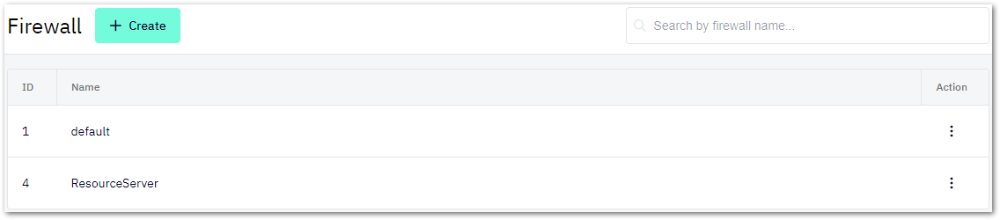

# Access Management
This chapter describes all the features that you must configure if you want to manage access to services running in your Shieldoo Mesh network:
- [Groups](/access_management/#groups)
- [Firewalls](/access_management/#firewalls)
- [Access Cards](/access_management/#access-cards)

{: .example-title }
> Access Management Example
> 
> The following schema demonstrates the use of Shieldoo's access management features:
> 
> 
> Notice the following points in the example schema:
> - __Developer__ - A user that needs access to both services running on the resource server.  
The developer has an access card that does the following:
>   1. Maps the user to the _Database_ and _Messaging_ groups.
>   2. Assigns a custom firewall to the user, blocking any inbound traffic and allowing any outbound traffic.
> - __Application Server__ - A server that runs a web application which needs to access the database running on the resource server.  
The application server has an access card that does the following:
>   1. Maps the server to the _Database_ group.
>   2. Assigns a custom firewall to the server, blocking any inbound traffic and allowing any outbound traffic.
> - __Resource Server__ - A server that runs two services which other servers or users need to access.  
The resource server has an access card that does the following:
>   1. Maps the server to the _Database_ and _Messaging_ groups.
>   2. Assigns a custom firewall to the server, allowing any outbound traffic and blocking all the inbound traffic except for the following ports:
>     - 5432 - Only users or servers in the _Database_ group can access it.
>   - 61616 - Only users or servers in the _Messaging_ group can access it.

## Groups
A group in a Shieldoo Mesh network is a mechanism that maps specific firewall rules to specific users or servers.  

A group alone does not do any mapping. It only indicates what type of access the group will manage. [Firewalls](/access_management/#firewalls) and [access cards](/access_management/#access-cards) will use created groups to do the mapping.

### Creating Groups
The following steps describe how to create groups:
1. Log in to your organization's Shieldoo Mesh web application.
2. Enable __Expert Mode__.
3. Go to the __Users__ \| __Groups__ section.
4. Click on the __Create__ button to open the __Create Group__ dialog.
5. Configure the group settings:
    - __Name__ - Give the group a descriptive name.
    - __Description__ - Describe the group's purpose.
6. Click on the __Create__ button to confirm the group's creation.
7. Continue by [creating firewalls](/access_management/#firewalls) that will utilize the created groups.

## Firewalls
A firewall in a Shieldoo Mesh network configures rules that determine which groups can access which services running on the network.  

### Creating Firewalls
The following steps describe how to create firewalls:
1. Log in to your organization's Shieldoo Mesh web application.
2. Enable __Expert Mode__.
3. Go to the __System Configuration__ \| __Firewall__ section.
4. Click on the __Create__ button to open the __Create Firewall__ dialog.
5. Configure the firewall settings:  

    - __Name__ - Give the firewall a descriptive name.
    - __Inbound Rules__ - Click on the __Create__ button to open the __Create Rule__ dialog where you configure rules that filter traffic passing from the network to the local computer (user or server).  
    - __Outbound Rules__ - Click on the __Create__ button to open the __Create Rule__ dialog where you configure rules that filter traffic passing from the local computer (user or server) to the network. 
1. Learn how to configure the firewall rules in the [Configuring Firewall Rules](/access_management/#configuring-firewall-rules) section.
2. Click on the __Create__ button to confirm the firewall's creation.
3. Continue by [creating access cards](/access_management/#access-cards) to map the created firewall rules to a specific server that runs the given services (e.g. a database).

{: .warning }
> By default, a user can be accessed by another user or by a server.
> 
> We highly recommend that you secure the users in your network with a specific firewall. Learn how to do that in the [Securing Users](/users/#securing-users) section.

### Configuring Firewall Rules
This section describes the settings of the __Create Rule__ dialog:  

- __Port__ - Define the port of the service for which you want to configure the given firewall rule.
- __Protocol__ - Define a specific protocol to be allowed:
  - [TCP](https://en.wikipedia.org/wiki/Transmission_Control_Protocol)
  - [UDP](https://en.wikipedia.org/wiki/User_Datagram_Protocol)
  - [ICMP](https://en.wikipedia.org/wiki/Internet_Control_Message_Protocol)
  - Any - Configures the rule to be evaluated regardless of the protocol used.
- __Access for__ - Select which group you want to map to the given rule:
  - _Any group_ - Defines that any user or server can access the given port.
  - _Specific groups_ - Use the provided __Groups__ combo box to select the groups whose users or servers can access the given port.

{: .example }
> If you map a rule to a group called _Database_, only users or servers mapped (in their [access cards](/access_management/#access-cards)) to that group will be able to access the given port.

## Access Cards
An access card in a Shieldoo Mesh network maps firewall rules and groups to specific servers or users. In other words, it determines which services users or servers can access within the network.

### Creating Server Access Cards
The following steps describe how to create access cards for servers:
1. Log in to your organization's Shieldoo Mesh web application.
2. Enable __Expert Mode__.
3. Go to the __Devices__ \| __Servers__ section.
4. Open the context menu of the server for which you want to create an access card.
5. Click on __Edit__ to open the server's settings.
6. Go to the __Access Rights__ tab where the access card is configured.
7. Configure the access card settings:  
   - __IP Address__ - Skip this setting unless the IP address of the given server has changed since you created it.
   - __Firewall configuration__ - Select one of the prepared firewalls.
   - __Groups__ - Map the server with all the desired groups.
   - __Punch back__ - Enable this check box if you want the node that you are trying to reach to connect back to your if your [UDP hole punching](https://en.wikipedia.org/wiki/UDP_hole_punching) fails. This is useful if a node is behind, for example, a symmetric NAT.
   - __Use websocket gateway__ - Check this check box if you want to use the Shieldoo websocket gateway to enforce the connection even from a site where, for example, UDP is not allowed.
   - __Valid Till__ - Define how long the access card will remain valid:
     - _Subscription lifetime_ - <!---TODO-->
     - _Custom expiration date - Define a custom expiration using the provided date picker.
8. Click on the __Save__ button to confirm the access card's creation.

### Creating User Access Cards
The following steps describe how to create access cards for users:
1. Log in to your organization's Shieldoo Mesh web application.
2. Enable __Expert Mode__.
3. Go to the __Users__ \| __Users__ section.
4. Open the context menu of the user for whom you want to create an access card.
5. Click on __Detail__ to open the __Access control__ tab.
6. Click on the __Create Access__ button.
7. Select one of the following options:  
    - _From scratch_ - Configure the access card manually.  
    The user access card settings are a simplified form of the [server access card settings](/access_management/#creating-server-access-cards).
    - _From template_ - Select a prepared user access card template.  
    You can prepare user access card templates in the __System Configuration__ \| __User Access Templates__ section.

### Connecting to Shieldoo Using an Access Card
When an administrator configures an access card for a user, Shieldoo forces the user to connect to the network under its restrictions.

If multiple access cards are available to a user, they can select which access card they want to use when connecting to the network.

The access cards become available to users as connection profiles in the context menu of Shieldoo's system tray icon.

