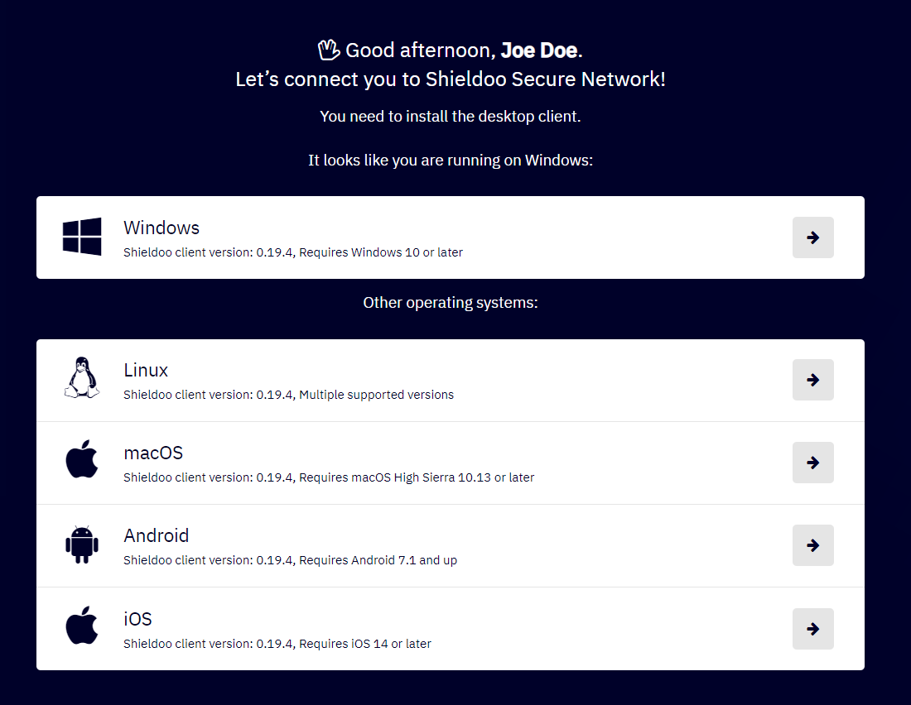
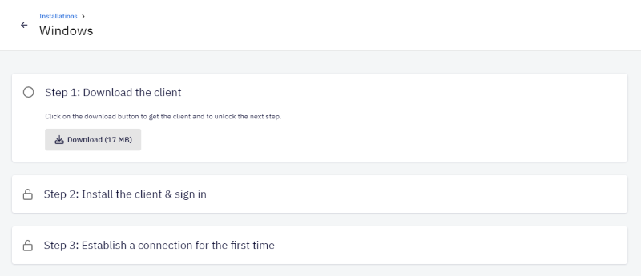
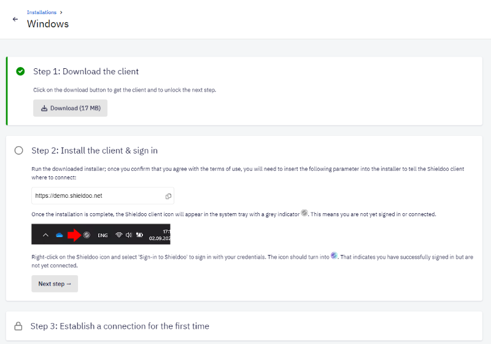
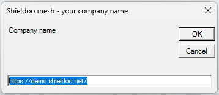
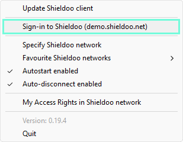
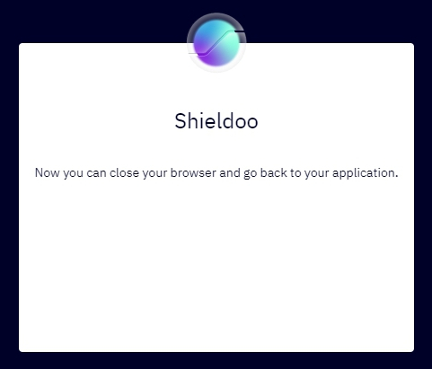

# Connect Me
This chapter describes the initial steps necessary for you to start using your Shieldoo Mesh network. We will go through following steps:  
- [Login](/connect_me/#login)
- [Installation](/connect_me/#installation-of-shieldoo)

## Login
At the moment when your Shieldoo Mesh network was successfully created together with your user and you were notified via email, this is the initial page requesting to login using your existing Microsoft or Google account.  

{: .note }
> User information
> 
> After successful login the name of the user, type of the user (e.g. 'Basic user' or 'Admin') and the icon is shown in upper right corner.  
> 
> 
> 
> By clicking on the arrow icon it is possible to check the details of the account __My Account__ or to sign out from the site __Sign Out__.

## Installation of Shieldoo 
The following steps describe how to install the Shieldoo desktop client:
1. Choose the download link according to the operating system you are using and click on the arrow button.

2. Download the client by clicking on the __Download__ button.  

3. Install the client according to the well-guiding instructions.

4. While installing the Shieldoo desktop client, the address parameter has to be entered tell the Shieldoo client where to connect.  

5. Last step consists of establishing the connection for the first time. 

6. When the setup is completed, you are securely connected! The following message is shown:

{: .note }
> Shieldoo icon
> 
> The icon in the system tray provides visual aid about the current status of the Shieldoo Mesh client.  
> 
> - __Not Connected__ or not yet signed in
> 
> - __Signed In__ - indcates successfully signed in but not yet connected
> 
> - __Connected__ - device is now connected
> 