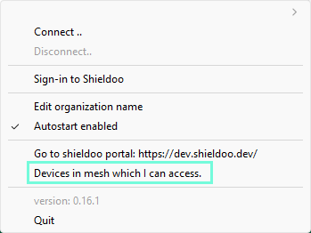
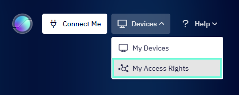
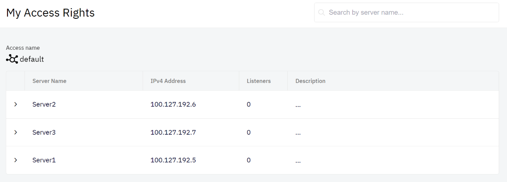

# Connect to a Server
This chapter describes the process of establishing a secure connection to a server in Shieldoo Mesh network. 

## Available servers
After successful login and installation of your Shieldoo Mesh network, you can now securely connect to any server in your Shieldoo Mesh network enabled to you by your administrator. 

To see the list of available servers, click on the Shieldoo status icon in the system tray  and choose __Devices in mesh which I can access__.

The other possibility is to click on __Devices__ button on the top left corner of the Shieldoo window and then click on __My Access Rights__ button.

It will show the list of available servers within your Shieldoo Mesh network with information about their names, IP addresses and short description:

